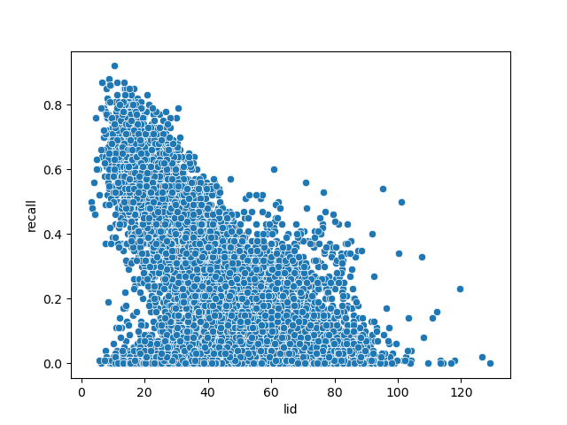
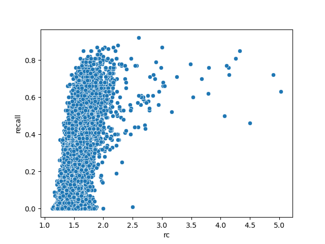
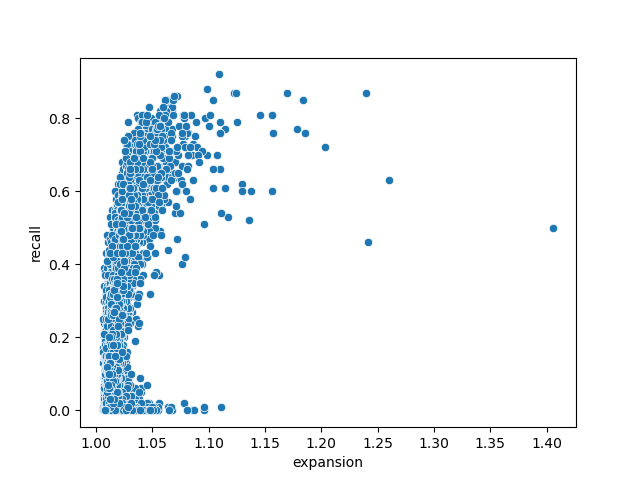

# Workloads Difficulty

This is a place to share papers/code/ideas/results/data about evaluating the
difficulty of query workloads and generating new queries using this
information.

## Papers

- [Generating data series query workloads](https://link.springer.com/article/10.1007/s00778-018-0513-x)
- [The role of local dimensionality measures in benchmarking nearest neighbor search](https://www.sciencedirect.com/science/article/pii/S0306437921000569)

## Setting up the development environment

So far, we are just using Python in this repository.
The required packages are listed in the `env.yaml` file, and the corresponding environment can be created using [`mamba`](https://mamba.readthedocs.io/en/latest/index.html):

```bash
mamba env create -f env.yaml
mamba activate workloads-difficulty
```

## A simple benchmark

The Python file `dimensionality_measures.py` contains, along with the implementation of functions to compute dimensionality measures, also a simple benchmark that will download the dataset `glove-100-angular.hdf5` from <https://ann-benchmarks.com> and run all the queries using the [`faiss-hnsw`](https://faiss.ai/) index.
For each query we measure the recall, the time, the local intrinsic dimensionality, the query expansion, and the relative contrast.
Since running the benchmark takes quite some time, the results are cached in `ans.csv`.

From this file a few plots are created, relating the recall attained by the index on different queries to the different dimensionality measures.

The queries that are run are to retrieve the 100 nearest neighbors.

#### Recall vs. LID



#### Recall vs. Relative Contrast



#### Recall vs. Expansion



